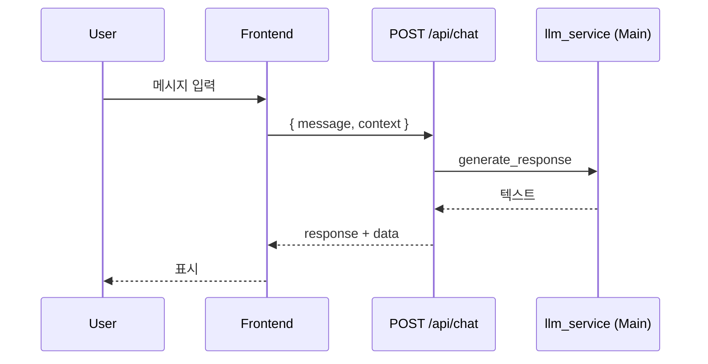
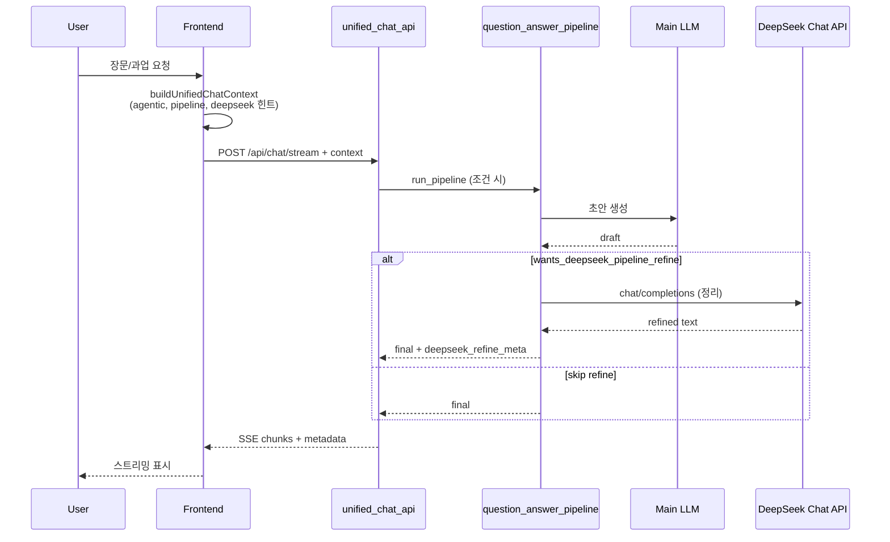
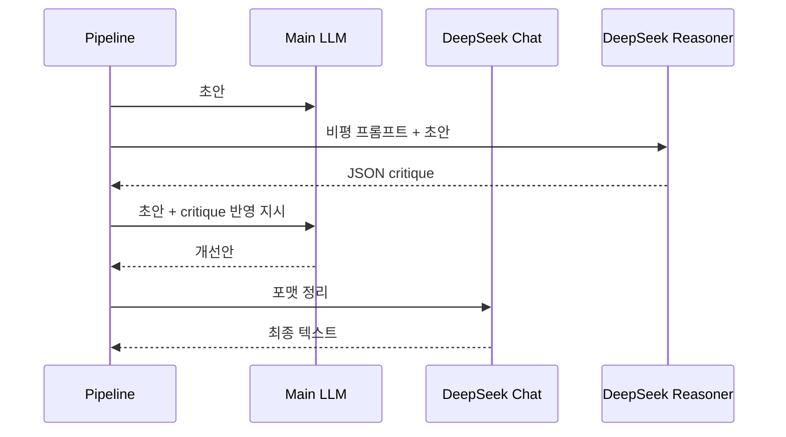

# Genspark형 + DeepSeek 이중 추론 엔진 — API 명세 · PRD · 시퀀스

**버전 1.1**  
**상위 설계**: [GENSPARK_DEEPSEEK_DUAL_INFERENCE_ENGINE_V2.md](./GENSPARK_DEEPSEEK_DUAL_INFERENCE_ENGINE_V2.md)  
**목적**: v2.0 통합 설계를 **개발팀이 바로 구현·연동**할 수 있도록 HTTP API, `context` 계약, SSE 메타, 환경 변수, **현재 구현 vs 로드맵 갭**을 한 문서로 고정한다.

---

## 1. PRD 요약

### 1.1 제품 목표

| ID | 목표 | 측정 가능 지표 (예) |
|----|------|---------------------|
| G-1 | 질문을 **과업**으로 해석하고 산출물 중심으로 응답 | `answer_blueprint`·`next_actions` 존재율 (에이전트/파이프라인 경로) |
| G-2 | 긴 문서·구조화 응답의 **형식 안정성** | 섹션 누락·중복 감소(수동 샘플링 QA) |
| D-1 | DeepSeek를 **최종 말하기**가 아닌 **정리·검수 서브엔진**으로 사용 | `deepseek_refine_meta.refine_applied` 비율(옵트인 시) |
| D-2 | 비용·지연 통제: 단순 Q&A는 보조 모델 **미호출** | Reasoner/Chat 호출 수·평균 지연(ms) |

### 1.2 사용자 스토리 (발췌)

- **US-1**: 대화 사용자로서, 한 번의 요청으로 **개요→본문→다음 행동**이 포함된 답을 받고 싶다.  
- **US-2**: 프로젝트/에이전트 모드 사용자로서, **질문→답변 파이프라인**을 통해 더 일관된 긴 답을 원한다.  
- **US-3**: 운영자로서, `GET /api/chat/llm-status`로 **메인 LLM provider**를 확인하고 싶다.  
- **US-4**: (옵트인) 한국어·장문 응답에서 **DeepSeek Chat**으로 초안만 다듬어 사실 추가 없이 정리되길 원한다.

### 1.3 수용 기준 (MVP 대비)

- [ ] `POST /api/chat`·`POST /api/chat/stream`이 **동일한 `context` dict**를 해석할 수 있다.  
- [ ] 스트리밍 종료 이벤트 `metadata`에 파이프라인/한국어/DeepSeek 관련 필드가 **있을 때만** 포함된다 (빈 메타 남발 금지).  
- [ ] `deepseek_review_layer_hints` 없이는 `pipeline_deepseek_refine`만으로 **DeepSeek refine이 동작하지 않는다** (현행 구현 규칙).  
- [ ] `PIPELINE_DEEPSEEK_REFINE=true` 이거나 `context.pipeline_deepseek_refine=true` 일 때, 키·힌트 조건을 만족하면 refine 시도.  
- [ ] v2 설계의 **DeepSeek Reasoner 전용 비평 JSON**은 본 문서 §7 **향후**로 표시하고, 구현 시 별도 엔드포인트 또는 내부 단계로 추가한다.

---

## 2. 베이스 URL · 공통

- **권장 베이스**: 앱에 따라 `http://localhost:5002` 등 (실제 포트는 `main_server` 기준).  
- **라우터 prefix**: 통합 대화은 대부분 **`/api`** 하위 (`unified_chat_api.router`).  
- **Content-Type**: `application/json` (스트리밍은 `text/event-stream`).  
- **인증**: 현재 저장소 기준으로는 별도 Bearer 없음(내부 배포 시 reverse proxy에서 처리 권장).

---

## 3. 엔드포인트 명세

### 3.1 `GET /api/health`

| 항목 | 내용 |
|------|------|
| 설명 | 통합 대화 API 헬스; LLM 연동 시 `llm_provider` 포함 |
| 응답 200 예 | `{ "status": "healthy", "service": "unified-chat-api", "llm_provider": "deepseek", ... }` |

---

### 3.2 `GET /api/chat/llm-status`  (`main_server`)

| 항목 | 내용 |
|------|------|
| 설명 | 대화에 쓰는 **메인** LLM provider·모델 요약 |
| 응답 | `{ "success": true, "provider": "deepseek", "model": "deepseek-chat", "summary": "DeepSeek(API)", "timestamp": "..." }` |

> DeepSeek **refine**은 별도 HTTP(`deepseek_optional_refine.py`)로 메인 provider와 독립일 수 있음 — UI에 “보조 정리 모델” 표시가 필요하면 `DEEPSEEK_REFINE_MODEL` 등을 확장해 노출할 수 있음(로드맵).

---

### 3.3 `POST /api/chat`  (별칭: `POST /api/unified/chat`)

**요청 본문** (`UnifiedChatRequest` 기준)

| 필드 | 타입 | 필수 | 설명 |
|------|------|------|------|
| `message` | string | ✅ | 사용자 메시지 (공백 불가, 상한 약 10,000자) |
| `context` | object \| list | 선택 | **아래 §4 계약**. list면 `conversationContext`로 정규화됨 |
| `user_id` | string | 선택 | 세션/사용자 |
| `conversation_id` | string | 선택 | 대화 ID |
| `quality` | string | 선택 | `basic` \| `enhanced` \| `ultimate` (기본 `enhanced`) |
| `mode` | string | 선택 | `writing`, `chat`, `analysis` 등 |
| `options` | object | 선택 | `writing_style` 등 |
| `project_id` | string | 선택 | 프로젝트 노트북 컨텍스트 |
| `temperature`, `max_tokens`, `response_style`, `perspective`, `diversity`, `diversity_level`, … | — | 선택 | 품질·다양성 튜닝 |

**성공 응답 (개략)**

- 최상위: `success`, `response` / `message` / `content` (동일 텍스트), `data`, `timestamp`  
- **옵션 메타** (생성 경로에 따라 존재):  
  - `next_actions`: `string[]`  
  - `answer_blueprint`: 구조화 힌트/개요  
  - `korean_style_notes`, `korean_quality_scores`  
  - `deepseek_refine_meta`: §5.3  
  - `workspace_tool_result`  

**에러**: `400` (빈 메시지 등), `500` (처리 실패) — 바디는 프로젝트 `error_response` 형식.

---

### 3.4 `POST /api/chat/stream`  (별칭: `POST /api/unified/chat/stream`)

**요청 본문** (`ChatStreamRequest`)

| 필드 | 타입 | 필수 | 설명 |
|------|------|------|------|
| `message` | string | ✅ | 동일 제약 |
| `context` | object \| list | 선택 | §4 |
| `session_id` | string | 선택 | `conversation_id` 대체 가능 |
| `user_id`, `conversation_id`, `quality`, `mode`, `options`, `project_id` | — | 선택 | 비스트리밍과 동일 계열 |
| `temperature`, `max_tokens`, `response_style`, … | — | 선택 | 동일 |

**SSE 이벤트**

- 진행: `data: {"content": "<chunk>", "done": false}\n\n`  
- 종료: `data: {"content": "", "done": true, "fullContent": "<전체>", "metadata": { ... }}\n\n`

**`metadata`에 실릴 수 있는 키** (구현 기준, 모두 선택적)

| 키 | 설명 |
|----|------|
| `next_actions` | 후속 행동 제안 |
| `answer_blueprint` | 답변 개요/블루프린트 |
| `qa_pipeline_trace_id` | 파이프라인 추적 ID |
| `task_plan` | 과업 계획 스냅샷 (`task_type`, `subquestions`, `pipeline_status`, `evidence_coverage` 등) |
| `verification_summary` | 내부 Verifier 요약 (`skipped`/`reason` 또는 `pass`, `issue_count`, 미리보기 목록 등) |
| `trace_id` | 파이프라인 추적 ID (`qa_pipeline_trace_id`와 동계열, JSON 폴백·일부 클라이언트용) |
| `evidence_coverage` | 근거 번들 커버리지(0~1), `task_plan`에도 중복 제공 가능 |
| `route_decision` | 라우팅 결정 요약 |
| `korean_style_notes` | 한국어 스타일 노트 |
| `korean_quality_scores` | 한국어 품질 점수 |
| `deepseek_refine_meta` | DeepSeek Chat 정리 메타 §5.3 |
| `workspace_tool_result` | 워크스페이스 도구 결과 |

---

## 4. `context` 객체 계약 (프론트 ↔ 백엔드)

프론트는 `buildUnifiedChatContext` (`src/services/generationPromptBuilder.ts`)로 객체를 만든다. 백엔드는 dict로 병합·프롬프트 주입한다.

### 4.1 Genspark / 파이프라인

| 키 | 타입 | 의미 |
|----|------|------|
| `agentic_genspark_style` | bool | Genspark식 과업·출력 힌트 포함 |
| `use_pipeline_v2` | bool | 질문→답변 파이프라인 우선 |
| `agentic_pipeline` | bool | 에이전트 파이프라인 플래그 |
| `qa_pipeline_fast_path` | bool | 참이면 `run_pipeline` 생략·직경로 우선 (`pipeline_gate`, 프로젝트 대화 **간결** 모드에서 전달) |
| `qa_pipeline_force` | bool | 참이면 위 생략 규칙 무시하고 파이프라인 강제 |
| `answer_mode` | string | `fast` → 파이프라인 생략 트리거; `expert`·`guided` → 라우터에서 근거 `preferred` 상향(질문이 이미 `required`면 유지); `expert`는 블루프린트 선행에도 사용 |
| `parsed_input` | object | `question`, `requirements`, `intent_type` 등 |
| `pipeline_web_evidence` | string | (선택) 파이프라인 단독 실행 시 웹 요약을 근거 번들에 `web_page`로 넣기. 별칭: `web_evidence_for_pipeline`, `preloaded_web_research` |
| `pipeline_skip_writer_llm_polish` | bool | `true`이면 Writer 단계 LLM 다듬기 생략(환경변수 `PIPELINE_WRITER_SKIP_LLM_POLISH`와 동효과) |

### 4.2 DeepSeek v2 힌트 · 옵트인 정리

| 키 | 타입 | 의미 |
|----|------|------|
| `deepseek_review_layer_hints` | bool | Chat/Reasoner용 **프롬프트·라우팅 힌트** 포함 (메인 생성 경로에 주입) |
| `pipeline_deepseek_refine` | bool | Q→A 파이프라인 **완료 후** DeepSeek Chat으로 본문 정리 시도 |
| `pipeline_deepseek_reasoner` | bool | 파이프라인에서 DeepSeek Reasoner **비평 JSON** 생성(서버 `PIPELINE_DEEPSEEK_REASONER`로도 옵트인). `PIPELINE_DEEPSEEK_REASONER_AUTO` 시 힌트+키 있으면 **자동** 설정 가능(`deepseek_auto_flags.py`) |
| (서버 전용) | — | `PIPELINE_DEEPSEEK_REFINE_AUTO` — 질문 복잡도에 따라 `pipeline_deepseek_refine` 자동 |
| `deepseek_chat_formatter_prompt` | string | 정리용 시스템 프롬프트 오버라이드 (길이 상한 있음) |
| `deepseek_reasoner_system_prompt` | string | 비평용 시스템 프롬프트 오버라이드 |

**정리(refine) 활성 조건** (`deepseek_optional_refine.wants_deepseek_pipeline_refine`)

1. `deepseek_review_layer_hints` 가 참  
2. `DEEPSEEK_API_KEY` 설정  
3. `PIPELINE_DEEPSEEK_REFINE` 환경이 true **또는** `pipeline_deepseek_refine` 이 참  

### 4.3 한국어 계층 (v3)

| 키 | 의미 |
|----|------|
| `korean_understanding`, `genre_control`, `korean_layer_instruction`, `enable_korean_depth` | 한국어 이해·출력 지시 |

### 4.4 메모리 · 기타

| 키 | 의미 |
|----|------|
| `advanced_memory_context` 등 | 고급 대화 메모리(백엔드에서 `_advanced_memory_instruction`으로 변환) |
| `projectId`, `project_instructions`, `project_guidelines`, … | 프로젝트 컨텍스트 |

---

## 5. DeepSeek 연동 (현 구현)

### 5.1 메인 답변 LLM

- `llm_service` + 환경 변수 `DEEPSEEK_API_KEY`, `DEEPSEEK_MODEL`, `DEEPSEEK_USE_LOCAL` 등으로 **메인** 생성에 DeepSeek 또는 다른 provider 사용 가능.  
- 이는 v2의 “**메인 모델**” 역할과 동일 축이다.

### 5.2 보조: DeepSeek Chat 정리 (파이프라인 후단)

- 구현 파일: `backend/api/question_answer_pipeline/deepseek_optional_refine.py`  
- 모델: `DEEPSEEK_REFINE_MODEL` → 기본 `DEEPSEEK_MODEL` → `deepseek-chat`  
- OpenAI 호환 `POST {DEEPSEEK_BASE_URL}/chat/completions`

### 5.3 `deepseek_refine_meta` 스키마 (관찰 기반)

성공 시 예:

```json
{
  "refine_attempted": true,
  "refine_applied": true,
  "model": "deepseek-chat",
  "tokens": 1234
}
```

스킵/실패 시 예: `skipped`, `error`, `short_refine_output` 등.

### 5.4 v2 대비 갭 — DeepSeek Reasoner

| v2 설계 | 현재 저장소 |
|---------|-------------|
| `deepseek-reasoner`로 JSON 비평 (`logic_gaps`, `improvement_actions` 등) | **별도 자동 단계 미구현** — 힌트는 `deepseekReviewPrompts`·context로 메인 프롬프트에 녹일 수 있음 |
| 메인이 비평 반영 재작성 | 재작성 루프는 **명시적 2-pass API**로 추가 권장 |

---

## 6. 프론트 환경 변수 (참고)

| 변수 | 역할 |
|------|------|
| `REACT_APP_PIPELINE_DEEPSEEK_REFINE` | 힌트 켜진 요청에 `pipeline_deepseek_refine` 포함 |
| `REACT_APP_DEEPSEEK_REVIEW_HINTS` | (문서화된 경우) `deepSeekReviewLayerHints` 기본 켜기 등 — `DEEPSEEK_SETUP.md`와 정합 유지 |

자세한 값은 [DEEPSEEK_SETUP.md](../DEEPSEEK_SETUP.md) 참고.

---

## 7. 시퀀스 다이어그램 (Mermaid)

### 7.1 기본 모드 — 메인 LLM만 (짧은 Q&A)



### 7.2 구조화 모드 — Q→A 파이프라인 + (옵트인) DeepSeek Chat 정리



### 7.3 목표 아키텍처 — Reasoner 비평 + 메인 재조합 (로드맵)



---

## 8. 오류 · 타임아웃 · 운영

| 영역 | 권장 |
|------|------|
| DeepSeek refine | 실패 시 **원문 반환** (현 구현). 로그에 `[DeepSeek refine]` |
| 타임아웃 | refine 기본 90초 (`deepseek_optional_refine`) |
| 비용 | Reasoner 도입 시 §7.3만 **고복잡도**에 제한 (v2 §11 정책) |

---

## 9. OpenAPI 3.0 · Reasoner 설계

| 산출물 | 경로 | 설명 |
|--------|------|------|
| **OpenAPI 스펙** | [../api/openapi-unified-chat.yaml](../api/openapi-unified-chat.yaml) | `/api/chat`, 스트림 별칭, `context`·응답 스키마 초안 — Swagger UI / 코드젠에 사용 |
| **Reasoner 내부 API (로드맵)** | [GENSPARK_DEEPSEEK_REASONER_INTERNAL_API.md](./GENSPARK_DEEPSEEK_REASONER_INTERNAL_API.md) | `deepseek-reasoner` 비평 JSON 계약·환경 변수·오케스트레이션 위치 |

로컬에서 스펙 확인 예:

```bash
npx @redocly/cli preview-docs docs/api/openapi-unified-chat.yaml
```

(또는 VS Code OpenAPI 확장)

---

## 10. 문서 간 링크

| 문서 | 용도 |
|------|------|
| [GENSPARK_DEEPSEEK_DUAL_INFERENCE_ENGINE_V2.md](./GENSPARK_DEEPSEEK_DUAL_INFERENCE_ENGINE_V2.md) | 철학·역할·파이프라인 모드 |
| [GENSPARK_DEEPSEEK_REASONER_INTERNAL_API.md](./GENSPARK_DEEPSEEK_REASONER_INTERNAL_API.md) | Reasoner 비평 API (설계 0.1) |
| [GENSPARK_REPO_IMPLEMENTATION_ORDER.md](./GENSPARK_REPO_IMPLEMENTATION_ORDER.md) | 코드 매핑·체크리스트 |
| [QUESTION_ANSWER_PIPELINE_ARCHITECTURE.md](../QUESTION_ANSWER_PIPELINE_ARCHITECTURE.md) | Q→A 총론 |
| [DEEPSEEK_SETUP.md](../DEEPSEEK_SETUP.md) | env·로컬/API 설정 |

---

*변경 이력: 1.1 — OpenAPI YAML·Reasoner 내부 API 문서 링크(§9·§10). 1.0 — v2.0 API/PRD/시퀀스 초안.*

## 개발자 검증

저장소 루트 검증 허브: [TESTING_GUIDE.md](../../TESTING_GUIDE.md) — `npm run test:routes` · (권장) `npm run test:sidebar-context` · 마무리 `npm run verify:completion` — [COMPLETION_CHECKLIST.md](../COMPLETION_CHECKLIST.md) · 배포 직전 [FINAL_CHECKLIST.md](../FINAL_CHECKLIST.md)(`npm run verify:final`) · 원격 `git push` 막힘 [PUSH_BLOCK_HANDOFF.md](../PUSH_BLOCK_HANDOFF.md)(`npm run maintain:push-block`).

